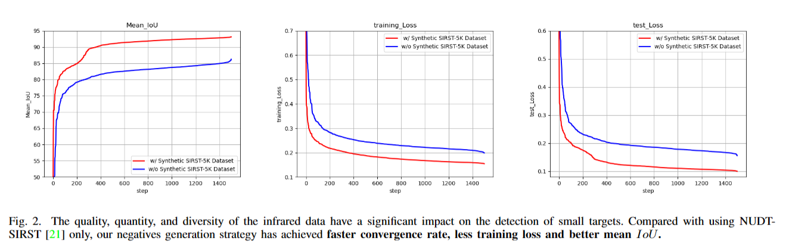
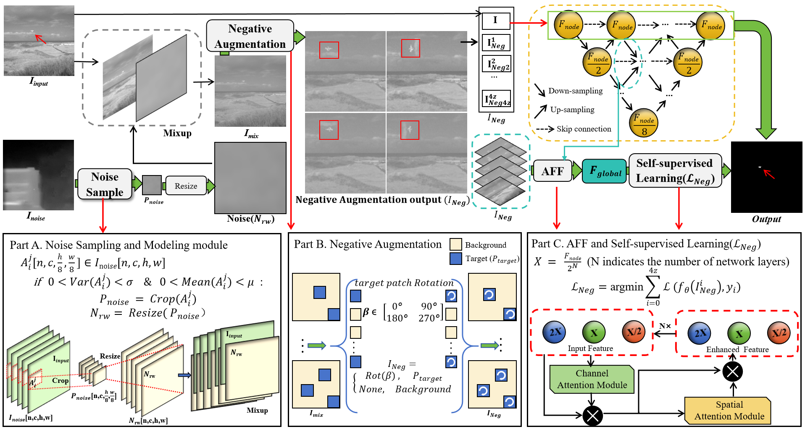
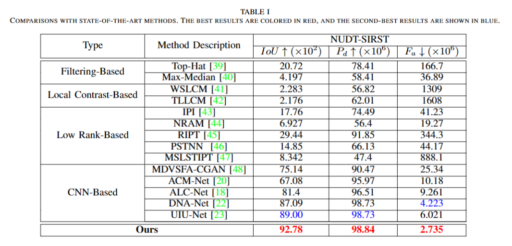

# SIRST-5K (TGRS 2024)


***SIRST-5K: Exploring Massive Negatives Synthesis with Self-supervised Learning for Robust Infrared Small Target Detection***
> [](https://arxiv.org/abs/2403.05416)<br>

## Contents
- [Introduction](#introduction)
  - [curve](#curve)
  - [Overview](#overview)
  - [Visual](#visual)
- [Dependencies and Installation](#dependencies-and-installation)
- [Dataset](#dataset )
- [Codes Demos](#codes-demos)
- [Usage](#usage)
- [Quantative Results ](#quantative-results)
- [Citations ](Citation)
- [Acknowledgement ](Acknowledgement)


## Introduction


### curve


### Overview



### Visual


## Dependencies and Installation
- Following [DNANet](https://github.com/YeRen123455/Infrared-Small-Target-Detection)
- Python == 3.8
- pip3 install torch torchvision torchaudio --index-url https://download.pytorch.org/whl/cu118
- pip install scikit-image
- pip install tqdm
- pip install matplotlib
- pip install tensorboard==2.14.0
- pip install opencv-python==4.8.0.76


## Dataset 

Download the dataset download dir models[[Baidu Drive](https://pan.baidu.com/s/1EG-loK86aWJL7M6bPQjivA?pwd=1234)][[Google Drive](https://drive.google.com/file/d/13aIrY5azO4bPwSGzDCzmgpwtpmYsysaD/view?usp=sharing)]. Currently, the available dataset are:
- `SIRST-5K`: The dataset synthesized using negatives generation strategies (Fig 2).


## Codes Demos

**Noise Sampling**

```bash
# Run Noise_Sampling.py directly
python codes/Noise_Sampling/Noise_Sampling.py
```

**Noise  displacement**

```bash
# Run add_noise.py directly
python codes/Mix_Rot/add_noise.py
```

**Negative**

```bash
# Run rot_patch.py directly
python codes/Mix_Rot/rot_patch.py
```
```bash
# Run rot_mask.py directly
python codes/Mix_Rot/rot_mask.py
```

Our negative augmentation strategies can produce large amounts of challenging image data. You can download the [SIRST-5K](https://drive.google.com/file/d/13aIrY5azO4bPwSGzDCzmgpwtpmYsysaD/view?usp=sharing) directly for training.

## Usage

#### 1. Train.

```bash
python train.py --base_size 256 --crop_size 256 --epochs 1500 --dataset [dataset-name] --split_method 50_50  --deep_supervision True --train_batch_size 16 --test_batch_size 16 --mode TXT

```
#### 2. Test.

```bash
python test.py --base_size 256 --crop_size 256 --st_model [trained model path] --model_dir [model_dir] --dataset [dataset-name] --split_method 50_50    --deep_supervision True --test_batch_size 1 --mode TXT 
```

#### 3. Visulize your predicts.
```bash
python visulization.py --base_size 256 --crop_size 256 --st_model [trained model path] --model_dir [model_dir] --dataset [dataset-name] --split_method 50_50    --deep_supervision True --test_batch_size 1 --mode TXT 
```

## Quantative Results 

| Model    | mIoU (x10(2)) | Pd (x10(6))|  Fa (x10(6)) ||
| ------------- |:-------------:|:-----:|:-----:|:-----:| 
|  Ours | 92.78|98.84  |2.735 |[[Weights]](https://drive.google.com/file/d/1pTmKST5E662KKfAlCUolheTLjN-PKWm1/view?usp=drive_link)|



## Citation
If you find this project useful for your research, please consider citing our paper. :smiley:
```bibtex
@ARTICLE{10496142,
  author={Lu, Yahao and Lin, Yupei and Wu, Han and Xian, Xiaoyu and Shi, Yukai and Lin, Liang},
  journal={IEEE Transactions on Geoscience and Remote Sensing}, 
  title={SIRST-5K: Exploring Massive Negatives Synthesis with Self-supervised Learning for Robust Infrared Small Target Detection}, 
  year={2024},
  volume={},
  number={},
  pages={1-1},
  keywords={Object detection;Self-supervised learning;Noise;Feature extraction;Data models;Task analysis;Data augmentation;Infrared small target detection;self-supervised learning;noise displacement;negative sample augmentation},
  doi={10.1109/TGRS.2024.3387125}}
```
## Acknowledgement
This project is build based on [DNANet](https://github.com/YeRen123455/Infrared-Small-Target-Detection). We thank the authors for sharing their code.

