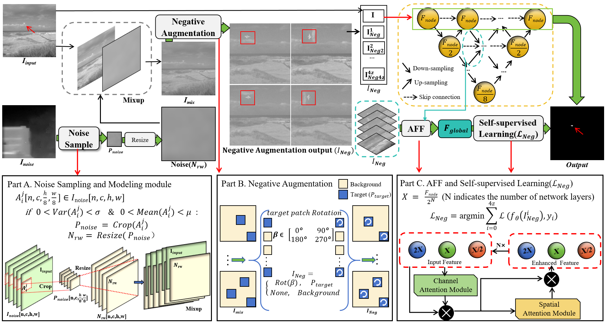

***SIRST-5K: Exploring Massive Negatives Synthesis with Self-supervised Learning for Robust Infrared Small Target Detection***
> [](https://arxiv.org/abs/2403.05416)<br>

## Contents
- [Introduction](#introduction)
  - [Overview](#overview)
  - [Visual](#visual)
- [Dependencies](#dependencies)
- [Offline Code](#offline-code)
- [Quantative Results ](#quantative-results)
- [Citations ](#citation)
- [Acknowledgement ](#acknowledgement)


## Introduction
### Overview


### Visual


## Dependencies
- Following [DNANet](https://github.com/YeRen123455/Infrared-Small-Target-Detection)


## Offline Code

**Noise Sampling**

```bash
# Run Noise_Sampling.py directly
python codes/Noise_Sampling/Noise_Sampling.py
```

**Noise  displacement**

```bash
# Run add_noise.py directly
python codes/Mix_Rot/add_noise.py
```

**Negative**

```bash
# Run rot_patch.py directly
python codes/Mix_Rot/rot_patch.py
```
```bash
# Run rot_mask.py directly
python codes/Mix_Rot/rot_mask.py
```


## Quantative Results 

| Model    | mIoU (x10(2)) | Pd (x10(2))|  Fa (x10(6)) ||
| ------------- |:-------------:|:-----:|:-----:|:-----:| 
|  Ours | 92.78| 98.84  |2.735 |[[Weights]](https://drive.google.com/file/d/1pTmKST5E662KKfAlCUolheTLjN-PKWm1/view?usp=drive_link)|


## Citation
If you find this project useful for your research, please consider citing our paper. :smiley:
```bibtex
@ARTICLE{10496142,
  author={Lu, Yahao and Lin, Yupei and Wu, Han and Xian, Xiaoyu and Shi, Yukai and Lin, Liang},
  journal={IEEE Transactions on Geoscience and Remote Sensing}, 
  title={SIRST-5K: Exploring Massive Negatives Synthesis with Self-supervised Learning for Robust Infrared Small Target Detection}, 
  year={2024},
  publisher={IEEE}
  doi={10.1109/TGRS.2024.3387125}
}
```
## Acknowledgement
This project is build based on [DNANet](https://github.com/YeRen123455/Infrared-Small-Target-Detection). We thank the authors for sharing their code.

